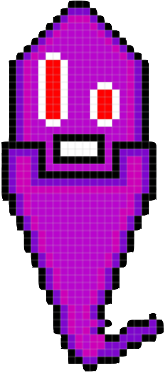

# tamagotchi-lab

  

  # Tamagotchi

  ### [Play Now](https://lucas-sloan.github.io/tamagotchi-lab/)

  ##### Lucas Sloan

  
  

  ## :pencil: Description

 - Keep him alive
 - Once any Stat reaches 10. You lose.
 - Pressing Play reduces Boredom by 2.
 - Pressing Feed reduces Hunger by 5.
 - Pressing Sleep reduces Sleep by 10.

 ## :mountain: Background

 - I decided to do this level-up lab with extra free-time I had during my course.
 - I enjoy pet simulators myself, so I wanted to see how to handle the logic.
 - I edited the framework of the CSS and HTML to more fit my style and included my own sprite work.

  ## :camera_flash: Screenshots 

  | Description       | Screenshot                                                |
  |:-----------------:|-----------------------------------------------------------|
  | <h3>Start</h3>  |        |
  | <h3 align="center">Game over</h3> |  |

## :framed_picture: Assets
######  My Own Sprite Work:

## :desktop_computer: Technologies Used

## :satellite: Future Goals

- [ ] Give Sprite an age ticker that calculates slower than the others to give a better game-over situation
- [ ] Have more sprites to choose from and animations.

